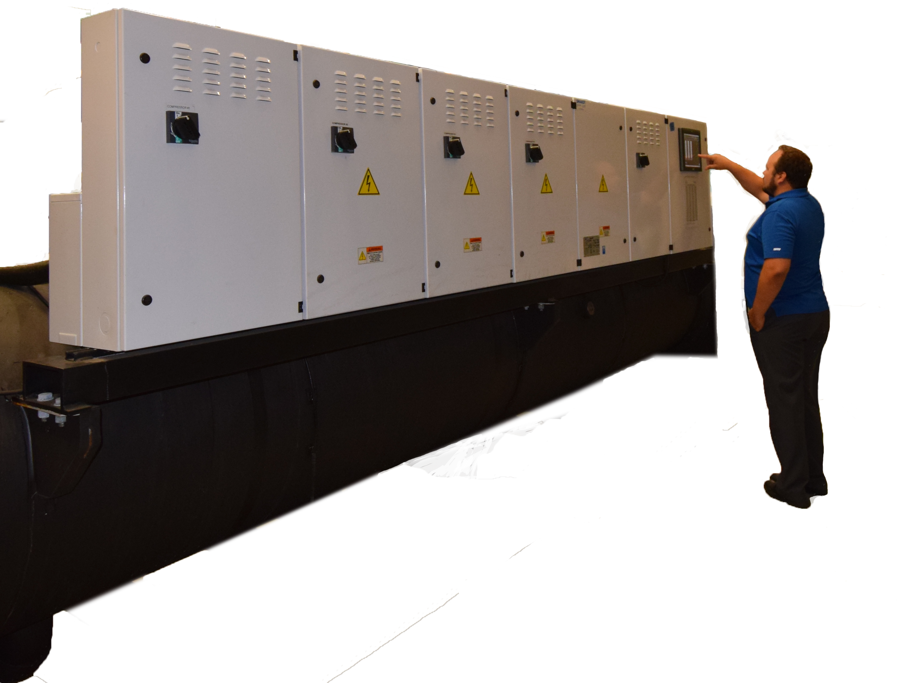

  
  
  
  

I designed and built a professional website for a Mechanical Engineering firm. I used Wordpress to implement Divi's Child Theme to bring a modern and slick feel to a linear one page design. I maintained the site, making minor syle changes and cycling out the content to reflect the vitality of the company.

For this project, I assummed the role of designer, programmer, graphic designer, photographer and content producer. My contributions added to the value of the company, which was then bought by the mainland behemouth; Ameresco.

You can learn more about the value-driven aquisition here [Ameresco Aquires Chelsea Group](https://www.ameresco.com/ameresco-acquires-chelsea-group-limited-to-expand-commercial-retail-and-industrial-services-in-hawaii/).

